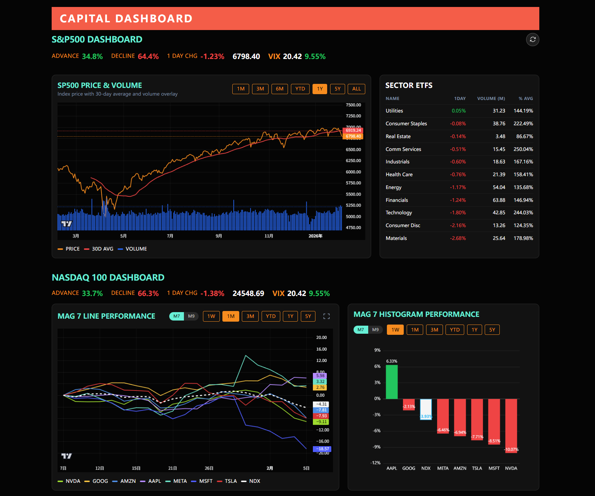

# Shepherd Capital Dashboard

前后端分离的美股可视化仪表盘。后端使用 FastAPI + SQLite + APScheduler 抓取多来源市场数据，前端采用 Vue 3 + Vite + Tailwind + lightweight-charts 实现多图表可视化。



## 功能特性

### 📊 市场概览

- **实时行情**: S&P 500 / Nasdaq 100 指数实时价格与涨跌
- **VIX 恐惧指数**: 市场波动率指标实时监控
- **板块轮动**: 11大行业 ETF (XL系列) 实时涨跌与成交量
- **涨跌比例**: 成分股上涨/下跌数量占比

### 📈 图表分析

- **相对表现图**: MAG7、多资产、板块对比
- **市场宽度**: 多指标宽度分析 (AD Line, McClellan Oscillator 等)
- **SPY/RSP 比率**: 市场集中度指标与 MAGS ETF 对比
- **恐惧贪婪指数**: CNN Fear & Greed Index 与 S&P 500 对比
- **Forward P/E**: 标普500远期市盈率走势
- **最大回撤**: 动态回撤追踪

### 🔧 杠杆 ETF 计算器 (新功能)

- **横向对比**: 输入标的后显示所有关联杠杆 ETF
- **目标价格模拟**: 计算标的达到目标价时杠杆 ETF 的预期价格
- **实时数据**: 支持盘前、盘后、夜盘多时段切换
- **夜盘数据**: 自动识别美东时间 8PM-4AM 显示 overnight 行情

## 数据来源与爬取技术

### 数据源一览

| 数据类型          | 来源                   | 爬取方式                  | 说明                                    |
| ----------------- | ---------------------- | ------------------------- | --------------------------------------- |
| **股票行情**      | Yahoo Finance          | `yfinance` 库             | 历史OHLCV、实时报价、盘前盘后数据       |
| **夜盘数据**      | Yahoo Finance 页面     | `curl_cffi` + 正则解析    | 解析页面嵌入的 JSON 获取 overnight 行情 |
| **市场宽度**      | Barchart               | `barchart_api` 库         | A/D Line、McClellan 等市场宽度指标      |
| **Forward P/E**   | MacroMicro (财经M平方) | `curl_cffi` + Base64 解码 | 解析页面嵌入的 Base64 编码数据          |
| **Fear & Greed**  | CNN                    | `urllib` 直接请求 JSON    | 公开 API 端点                           |
| **成分股数据**    | GitHub (自维护)        | `requests` + CSV 解析     | S&P 500 / Nasdaq 100 成分股列表         |
| **杠杆 ETF 列表** | GitHub (自维护)        | `requests` + CSV 解析     | 杠杆ETF与标的对应关系                   |

### 爬取技术详解

#### 1. yfinance (Yahoo Finance 官方库)

```python
import yfinance as yf
ticker = yf.Ticker("NVDA")
info = ticker.info  # 实时报价
hist = ticker.history(period="1y")  # 历史K线
```

- 用于: 历史行情、实时报价、盘前/盘后价格
- 特点: 批量查询高效、无需 API Key

#### 2. curl_cffi (反反爬利器)

```python
from curl_cffi import requests
response = requests.get(url, impersonate="chrome110")
```

- 用于: MacroMicro Forward P/E、Yahoo Finance 夜盘页面
- 特点: 模拟浏览器指纹绕过 Cloudflare 等防护

#### 3. barchart_api (市场宽度数据)

```python
import barchart_api
client = barchart_api.Api()
response = client.get_stock(symbol="$ADDN", max_records=365)
```

- 用于: 市场宽度指标 (AD Line, McClellan 等)
- 特点: 第三方封装库，无需 API Key

#### 4. urllib / requests (标准 HTTP 请求)

```python
from urllib.request import urlopen, Request
request = Request(url, headers={"User-Agent": "..."})
with urlopen(request, timeout=10) as response:
    data = json.load(response)
```

- 用于: CNN Fear & Greed API、GitHub CSV 文件
- 特点: 公开接口无反爬，直接请求即可

### 交易时段自动识别

系统根据美东时间自动切换数据源：

| 时段               | 美东时间          | 数据来源                          |
| ------------------ | ----------------- | --------------------------------- |
| 夜盘 (Overnight)   | 8:00 PM - 4:00 AM | Yahoo Finance 页面 overnight 数据 |
| 盘前 (Pre-market)  | 4:00 AM - 9:30 AM | yfinance preMarketPrice           |
| 常规 (Regular)     | 9:30 AM - 4:00 PM | yfinance regularMarketPrice       |
| 盘后 (Post-market) | 4:00 PM - 8:00 PM | yfinance postMarketPrice          |

**夏令时自动处理**: 使用 Python 标准库 `zoneinfo` 正确处理 EST/EDT 切换

## 目录结构

```
backend/        FastAPI 服务、数据库、scheduler
  app/
    services/   数据爬取与处理逻辑
      market_data.py     # 行情数据 (yfinance)
      breadth.py         # 市场宽度 (barchart_api)
      forward_pe.py      # Forward P/E (MacroMicro)
      leveraged_etf.py   # 杠杆ETF计算器
      overnight_data.py  # 夜盘数据 (curl_cffi)
      realtime.py        # 实时行情
backend/data/   默认 SQLite 输出目录（market.db）
frontend/       Vue3 单页应用、图表组件
deploy/         docker/nginx 相关文件
```

## 环境要求

- Python 3.10+
- Node.js 18+（含 npm）
- Docker / Docker Compose（可选，用于一键部署）

## 本地开发

### 后端

```bash
cd backend
python -m venv .venv
source .venv/bin/activate  # Windows: .venv\Scripts\activate
pip install -r requirements.txt
pip install -e .
uvicorn app.main:app --reload --host 0.0.0.0 --port 8500
```

### 前端

```bash
cd frontend
npm install
npm run dev -- --host
```

- 接口地址通过 `frontend/.env` 配置，默认 `VITE_API_BASE_URL=/api`

### Windows 一键启动

若依赖已安装，可在仓库根目录运行：

```powershell
start-dev.bat  # 可选参数：<backend_host> <backend_port> <frontend_port>
```

脚本会新开两个窗口分别启动后端与前端。

## Docker 部署

```bash
docker compose up --build -d
```

- `backend`：FastAPI，SQLite 数据写入 `backend/data/market.db`
- `frontend`：Vite 构建后由 nginx 提供静态资源
- `proxy`：nginx 反向代理，对外暴露 80 端口，`/api` 转发后端，其余流量走前端

若已有外部代理，可仅运行 `backend` 与 `frontend` 服务并自行暴露端口。

## 依赖库说明

### 核心依赖

| 库             | 用途                   |
| -------------- | ---------------------- |
| `fastapi`      | Web 框架               |
| `yfinance`     | Yahoo Finance 数据接口 |
| `curl_cffi`    | 反反爬 HTTP 客户端     |
| `barchart_api` | Barchart 市场宽度数据  |
| `pandas`       | 数据处理               |
| `sqlmodel`     | ORM (SQLite)           |
| `apscheduler`  | 定时任务调度           |

### 时区处理

| 库         | 用途                                    |
| ---------- | --------------------------------------- |
| `zoneinfo` | Python 3.9+ 标准库，处理 EST/EDT 夏令时 |

## 快速测试

- 后端：可运行 `pytest test/test_yfquery.py` 或 `pytest test/test_barchart_nvda.py`（需联网）。
- 夜盘测试：`python test/overnight_query2.py`
- 前端：`npm run build` 验证编译是否通过。

更多细节见 `backend/README.md`，组件与接口说明可阅读对应源码注释。

## License

MIT
