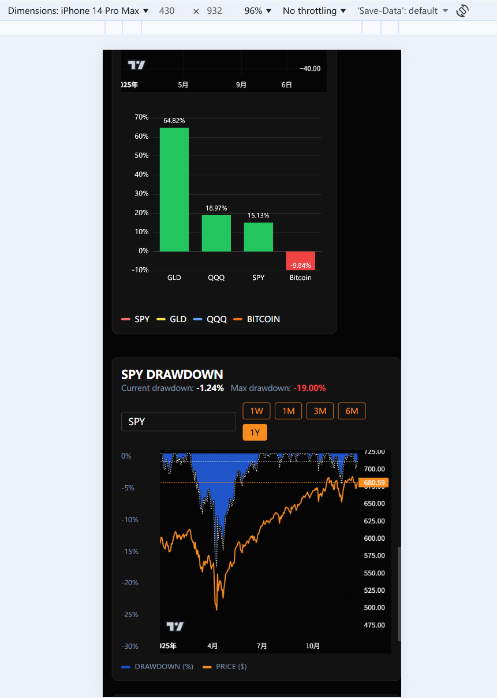

# Capital Dashboard

English | [中文](README.md)

A full-stack US stock market visualization dashboard. Backend powered by FastAPI + SQLite + APScheduler for multi-source market data aggregation, frontend built with Vue 3 + Vite + Tailwind + lightweight-charts for interactive charting.



## Features

### 📊 Market Overview

- **Real-time Quotes**: S&P 500 / Nasdaq 100 index live prices and changes
- **VIX Fear Index**: Real-time market volatility monitoring
- **Sector Rotation**: 11 sector ETFs (XL series) with live price changes and volume
- **Advance/Decline Ratio**: Component stock advance/decline percentage

### 📈 Chart Analysis

- **Relative Performance**: MAG7, multi-asset, and sector comparison charts
- **Market Breadth**: Multiple breadth indicators (AD Line, McClellan Oscillator, etc.)
- **SPY/RSP Ratio**: Market concentration indicator vs MAGS ETF
- **Fear & Greed Index**: CNN Fear & Greed Index vs S&P 500 comparison
- **Forward P/E**: S&P 500 forward price-to-earnings ratio trend
- **Maximum Drawdown**: Dynamic drawdown tracking

### 🔧 Leveraged ETF Calculator (New Feature)

- **Cross-comparison**: Enter underlying ticker to display all related leveraged ETFs
- **Target Price Simulation**: Calculate expected leveraged ETF prices when underlying reaches target
- **Real-time Data**: Supports pre-market, after-hours, and overnight trading sessions
- **Overnight Data**: Automatically detects 8PM-4AM ET to display overnight quotes

## Data Sources & Scraping Technology

### Data Sources Overview

| Data Type              | Source                   | Scraping Method              | Description                                              |
| ---------------------- | ------------------------ | ---------------------------- | -------------------------------------------------------- |
| **Stock Quotes**       | Yahoo Finance            | `yfinance` library           | Historical OHLCV, real-time quotes, pre/post market data |
| **Overnight Data**     | Yahoo Finance Page       | `curl_cffi` + regex parsing  | Parse embedded JSON for overnight quotes                 |
| **Market Breadth**     | Barchart                 | `barchart_api` library       | A/D Line, McClellan, and other breadth indicators        |
| **Forward P/E**        | MacroMicro               | `curl_cffi` + Base64 decode  | Parse Base64-encoded embedded page data                  |
| **Fear & Greed**       | CNN                      | `urllib` direct JSON request | Public API endpoint                                      |
| **Constituents Data**  | GitHub (self-maintained) | `requests` + CSV parsing     | S&P 500 / Nasdaq 100 constituent lists                   |
| **Leveraged ETF List** | GitHub (self-maintained) | `requests` + CSV parsing     | Leveraged ETF to underlying mapping                      |

### Scraping Technology Details

#### 1. yfinance (Official Yahoo Finance Library)

```python
import yfinance as yf
ticker = yf.Ticker("NVDA")
info = ticker.info  # Real-time quotes
hist = ticker.history(period="1y")  # Historical candlesticks
```

- Used for: Historical data, real-time quotes, pre/post market prices
- Features: Efficient batch queries, no API key required

#### 2. curl_cffi (Anti-Anti-Scraping Tool)

```python
from curl_cffi import requests
response = requests.get(url, impersonate="chrome110")
```

- Used for: MacroMicro Forward P/E, Yahoo Finance overnight pages
- Features: Browser fingerprint simulation to bypass Cloudflare protection

#### 3. barchart_api (Market Breadth Data)

```python
import barchart_api
client = barchart_api.Api()
response = client.get_stock(symbol="$ADDN", max_records=365)
```

- Used for: Market breadth indicators (AD Line, McClellan, etc.)
- Features: Third-party wrapper library, no API key required

#### 4. urllib / requests (Standard HTTP Requests)

```python
from urllib.request import urlopen, Request
request = Request(url, headers={"User-Agent": "..."})
with urlopen(request, timeout=10) as response:
    data = json.load(response)
```

- Used for: CNN Fear & Greed API, GitHub CSV files
- Features: Public endpoints, no anti-scraping measures

### Automatic Trading Session Detection

The system automatically switches data sources based on Eastern Time:

| Session     | Eastern Time      | Data Source                       |
| ----------- | ----------------- | --------------------------------- |
| Overnight   | 8:00 PM - 4:00 AM | Yahoo Finance page overnight data |
| Pre-market  | 4:00 AM - 9:30 AM | yfinance preMarketPrice           |
| Regular     | 9:30 AM - 4:00 PM | yfinance regularMarketPrice       |
| Post-market | 4:00 PM - 8:00 PM | yfinance postMarketPrice          |

**Automatic DST Handling**: Uses Python standard library `zoneinfo` for proper EST/EDT transitions

### ⚠️ Regional Access Restrictions

Some data sources (e.g., MacroMicro) can be accessed freely from US nodes, but may be blocked by Cloudflare verification when accessed from non-US regions (such as HK nodes), causing Forward P/E and related data fetching to fail. It is recommended to deploy on US nodes, or configure a proxy for these requests.

## Directory Structure

```
backend/        FastAPI service, database, scheduler
  app/
    services/   Data scraping and processing logic
      market_data.py     # Market data (yfinance)
      breadth.py         # Market breadth (barchart_api)
      forward_pe.py      # Forward P/E (MacroMicro)
      leveraged_etf.py   # Leveraged ETF calculator
      overnight_data.py  # Overnight data (curl_cffi)
      realtime.py        # Real-time quotes
backend/data/   Default SQLite output directory (market.db)
frontend/       Vue3 SPA, chart components
deploy/         docker/nginx configuration files
```

## Requirements

- Python 3.10+
- Node.js 18+ (with npm)
- Docker / Docker Compose (optional, for one-click deployment)

## Local Development

### Backend

```bash
cd backend
python -m venv .venv
source .venv/bin/activate  # Windows: .venv\Scripts\activate
pip install -r requirements.txt
pip install -e .
uvicorn app.main:app --reload --host 0.0.0.0 --port 8500
```

### Frontend

```bash
cd frontend
npm install
npm run dev -- --host
```

- API endpoint configured in `frontend/.env`, default `VITE_API_BASE_URL=/api`

### Windows Quick Start

If dependencies are installed, run from repository root:

```powershell
start-dev.bat  # Optional args: <backend_host> <backend_port> <frontend_port>
```

The script opens two windows for backend and frontend respectively.

## Docker Deployment

```bash
docker compose up --build -d
```

- `backend`: FastAPI, SQLite data written to `backend/data/market.db`
- `frontend`: Vite build served by nginx as static assets
- `proxy`: nginx reverse proxy, exposes port 80, `/api` routes to backend, rest to frontend

If you have an external proxy, you can run only `backend` and `frontend` services and expose ports manually.

## Dependencies

### Core Dependencies

| Library        | Purpose                        |
| -------------- | ------------------------------ |
| `fastapi`      | Web framework                  |
| `yfinance`     | Yahoo Finance data interface   |
| `curl_cffi`    | Anti-anti-scraping HTTP client |
| `barchart_api` | Barchart market breadth data   |
| `pandas`       | Data processing                |
| `sqlmodel`     | ORM (SQLite)                   |
| `apscheduler`  | Scheduled task runner          |

### Timezone Handling

| Library    | Purpose                                               |
| ---------- | ----------------------------------------------------- |
| `zoneinfo` | Python 3.9+ standard library for EST/EDT DST handling |

## Quick Testing

- Backend: Run `pytest test/test_yfquery.py` or `pytest test/test_barchart_nvda.py` (requires network)
- Overnight: `python test/overnight_query2.py`
- Frontend: `npm run build` to verify compilation

See `backend/README.md` for more details, and read source code comments for component and API documentation.

## License

MIT
